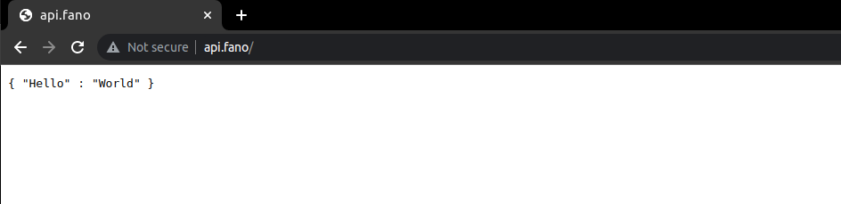

# Fano Web Framework REST API Skeleton Application

REST API Web application skeleton using Fano, Pascal web application framework

## Requirement

- [Free Pascal](https://www.freepascal.org/) >= 3.0
- Web Server (Apache, nginx)
- [Fano Web Framework](https://github.com/fanoframework/fano)
- [Fano CLI](https://github.com/fanoframework/fano-cli)

## Setup

```
$ git clone https://github.com/fanoframework/fano-api.git --recursive
$ cd fano-api
$ ./tools/config.setup.sh
$ ./build.sh
$ sudo fanocli --deploy-cgi=api.fano
```

Open Internet Browser and visit `http://api.fano`, you should get `{"Hello": "world"}` printed in browser.

